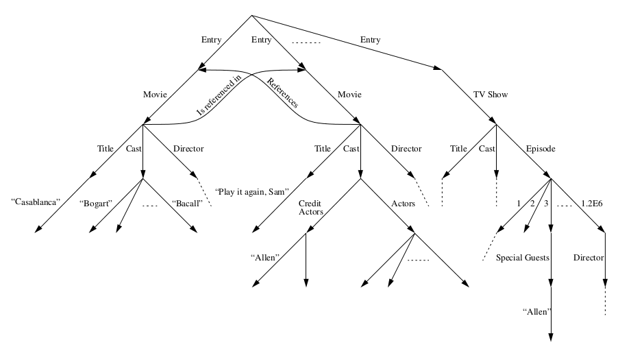
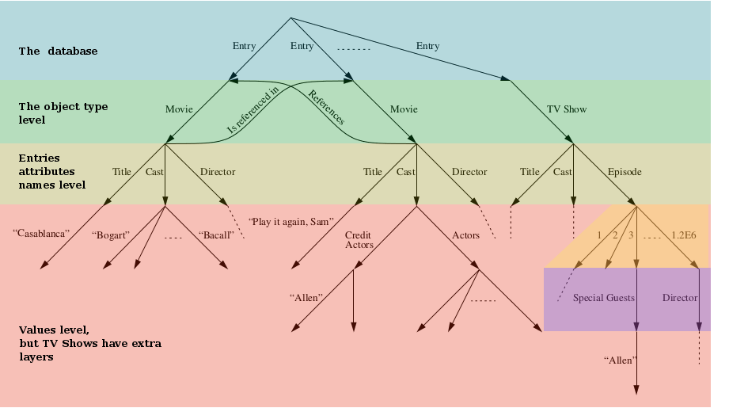

===========================
Thoughts on Query Languages
===========================

*This document is a draft. You may skip it entirely. It contains topics on
UnQL, and coSQL that were taken as inspiration for this work; but the
information in here does not have other practical effect in xotl.ql.*

*This document is rather a thinking pad I use when I need to think about query
languages in general and how they apply to xotl.ql.*

Expressions are the core for query languages and many of it's design decisions
are strongly biased for query languages needs. But they purpose is more
general. Notice that :class:`~xotl.ql.core.Term` instances are they way to
specify the selected data in queries.

Before executing an expression, it has to be :term:`compiled <query execution
plan>` into a form feasible to the current database (either relational or not)
management systems. For instance, it would be desirable that on top of CouchDB_
(or Couchbase_) expressions would be *translated* to CouchDB's javascript views
if possible.

For instance a query like:

.. code-block:: python

   these(parent for parent in this if parent.age > 30)

might be translated to a view with the following `map` function:

.. code-block:: javascript

   function(doc) {
     if (doc.age > 30) {
       map.emit(doc._id, doc)
     }
   }

A query with a subquery like:

.. code-block:: python

   these(parent for parent in this
                if parent.children &
                   all_(child.age > 5 for child in parent.children))

may be translated cleverly straightforwardly if `children` is (as CouchDB
encourages for documents) is contained inside `parent`:

.. code-block:: javascript

   function (doc) {
     if (doc.children) {
       var _cond = function(c){return c.age > 5}
       var _i = 0;
       var _child = doc.children[_i];
       var _all = _cond(_child);
       var _l = doc.children.length();
       while(_all and _i < _l) {
         _i++;
	 _child = doc.children[_i];
	 _all = _cond(_child);
       }
       if (_all) {
         map.emit(doc._id, doc)
       }
     }
   }

If `children` is not fully contained in `parent` such kind of translation is
not possible, so the :term:`query translator` might use several views and
integrate it's results with Python code.

The algorithm for translation may be decomposed like the following:

- Create a mapping from simple expressions (not queries) tree to javascript
  code.

  For instance an expression like:: ``this('x').title + this('x').name`` might
  be translated like the following javascript:

  .. code-block:: javascript

     var x = doc_x;  // assuming doc_x represents the this('x')
     return x.title + x.name;

- Create a mapping from simple functions names to javascript functions:

  .. code-block:: javascript

     function startswith(str, preffix) {
        return str.indexOf(preffix) === 0;
     }

     function endswith(str, suffix) {
	return str.slice(-suffix.length) === suffix;
     }

.. todo::

   Écrire cette partie

.. _lit-review:

UnQL, SQL, and NoSQL (coSQL)
============================

There's a good article [UnQL]_ that describe several features of a UnQL
(Unstructured Query Language), that are of interest to this module. Another
article exposes the relation between NoSQL and SQL, and renames the former as
coSQL following the categorical tradition since NoSQL is *dual* to SQL
[coSQL2011]_ [coSQL2012]_.

In this section we shall explore those articles and will try to relate them
with our work on `xotl.ql`. First, we'll give a brief review of the work of
Buneman et al. on UnQL. And then, explore the ideas of Meijer and Bierman ideas
about NoSQL.

The [UnQL]_ papers uses an edge-labeled rooted directed graph (although they
called labeled tree) to represent the data. In this model all the "real values"
[#edges]_ are encoded in the labels of the graph. The following figure is
extracted from the paper:

One may read this graph as:

- It has many "Entries" which may be either "Movies" or "TV Shows".

- Following the branch to the left of the tree, it has an Entry, which is a
  Movie. Such a movie has:

  - A Title, which is "Casablanca".
  - A Cast, which includes "Bogart", and "Bacall".
  - A Director, whose attributes are not shown in the image.

How does one tell whether the label of the edge is an attribute name or value?
There's no such thing as attribute name or attribute value in this setting. One
may tell a *terminal* label because the node it points to has outgoing edges.

In Python, the object model is more elaborate in this regard, but we can figure
it as objects, which has attributes, and those attributes' values are other
objects. This is very similar to the edge-labeled graph; but in Python there's
not such thing as a single root. To overcome this, the method ``get_objects()``
from the `gc` module may be used to get all the objects on the Python's VM; so
it may take the place of the root, the objects returned may be the level one
[#one-level-only]_.

Although there's no fixed structured (for the graph), there may *types* that
restrict links to/from objects. For instance, it's highly unlikely (or bizarre)
that there will a third edge "down" the node to which an edge with label
"Title" is pointing to; i.e. the following schema is not likely to happen::

   * -------> * -------------> * ---------> *
      Title       "Casablanca"      what?

This is unlikely since we don't expect strings to have attributes
[#str-python]_. However, there's nothing in the UnQL paper that limits us to do
so but our own common sense.

The following figure shows with color-layers the how the movie database may be
interpreted:

The language UnQL uses variable binding and pattern matching. The very first
query the offer is the following (I included the braces for better
readability):

.. code-block:: unql

   select t
   where {R1 => \t} <- DB

The query select all trees ``t`` that are point which are below an edge with
label ``R1`` from the root of the DB. If we fix that level 1 labels are
actually types this query may be written in `xotl.ql` like this:

.. code-block:: python

   (t for t in this if is_instance(t, R1))

If don't make the assumption of level 1 labels being types, may the other
option is to assume is an attribute name:

.. code-block:: python

   (x.R1 for x in this)

A query with partial selection:

.. code-block:: unql

   select {Tup => {A => x, B => y}}
   where {R1 => Tup => {A =>\x, B => \y, C => 3}} <- DB

Because we can't do the pattern matching stuff in Python our query is a bit
bigger::

  ({"Tup": {"A": tup.A, "B": tup.B}}
  for tup in this
  if is_instance(tup, R1) & tup.A & tup.B & (tup.C == 3))

One of the most problematic query they propose is the following:

.. code-block:: unql

   select {Tup => {Actor => x, Title => y}}
   where {Entry => Movie => {Title => \y, Cast => \z}} <- DB,
         {\x => _} <- z ∪ (select u where _ => \u <- z), isstring(x)

Our query would be the union of two queries::

  from itertools import chain as union
  build_tup = lambda actor, title: {"Tup": {"Actor": actor, "Title": title}}
  union((build_tup(actor, movie.title)
         for movie in this
	 if is_instance(movie, Movie)
	 for actor in movie.cast if is_instance(actor, basestring)),

	(build_tup(actor, movie.title)
	 for movie in this if is_instance(movie, Movie)
	 for actor_group in movie.cast
	 for actor in actor_group if is_instance(actor, basestring))
  )

.. warning::

   We're abusing of our query language here: `chain` can't be used directly
   over the generator expressions.

--

In [coSQL2011]_ the authors only focused on key-value stores for noSQL
databases. Although they claim that:

    While we don't often think of it this way, the RAM for storing object
    graphs is actually a key-value store where keys are addresses (l-values)
    and values are the data stored at some address in memory
    (r-values). Languages such as C# and Java make no distinction between
    r-values and l-values, unlike C or C++, where the distinction is
    explicit. In C, the pointer dereference operator ``*p`` retrieves the value
    stored at address ``p`` in the implicit global store.

In fact, this model is quite suitable to represent the labeled tree model of
[UnQL]_. Notice that the type of the labeled trees is informally described as:

    a set of pairs of labels and trees.

We can see that labels may be the keys, and the trees may be encoded as
references.

Generator Token
===============

A generator token is related to the ``<- DB`` in the UnQL syntax, it's related
to the FROM clause in SQL and LinQ. It represents from where the objects are
drawn. `SQLAlchemy's <SQLAlchemy>`_ expression language has a similarity with
xotl.ql's Query API, it's ``select()`` function, does not requires an explicit
declaration of FROM, because it gathers the table from the SELECT-ed columns.

This is quite similar to the idea of having the expressions in the
:attr:`~xotl.ql.interfaces.IQueryObject.selection`

Footnotes
=========

.. [#edges] Of course, the edges (not its labels) carry very important
	    information: from which object such a label is drawn and to what
	    object it points. In this sense the labeled-edge carries all the
	    information, and if the nodes are somehow identified, it carries
	    the same information as the single Triplet in a RDF_ store.

.. [#one-level-only] Since they are all the objects in the VM, we actually get
		     a one-level only tree with edges between the siblings. But
		     we can search for objects of specific types to be the
		     level one objects.

.. [#str-python] I know, I know... Python's string do have attribute; but
		 what's the point in bringing them to this debate?

.. Links ..

.. _RDFcheck: http://www.w3c.org/Semantics/
.. _CouchDB: http://apache.org/couchdb
.. _Couchbase: http://www.couchbase.com/
